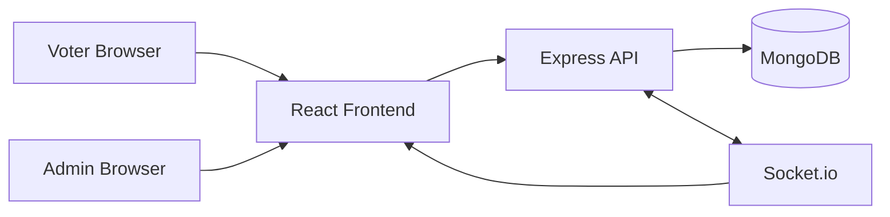
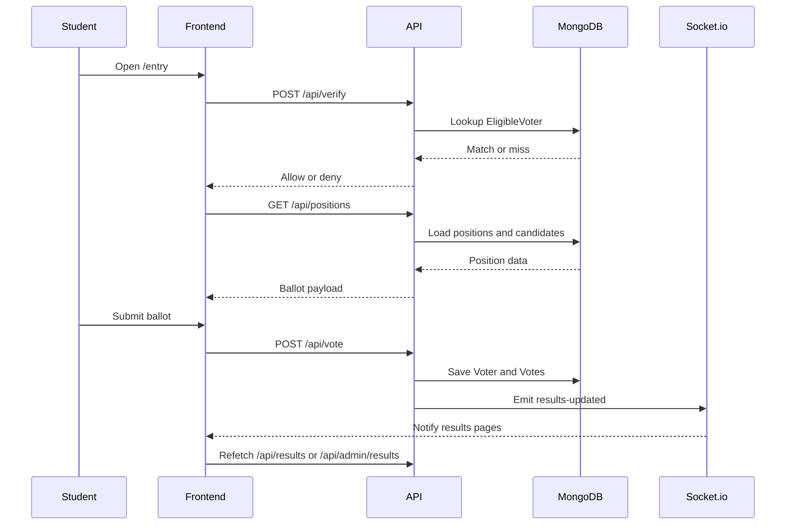

# ClassVote Architecture

This document turns the current repository into a working mental model: what runs where, how requests move through the app, and how the voting workflow is supposed to behave.

## 1. System Shape

ClassVote is split into three layers:

1. Frontend: React + Vite app in [frontend/src](frontend/src)
2. Backend: Express + Mongoose API in [backend](backend)
3. Database: MongoDB collections managed through Mongoose models

The frontend handles the user interface and local navigation. The backend owns election state, roster validation, vote persistence, and live result broadcasting. MongoDB stores the durable election data.



## 2. Repository Map

### Frontend

- [frontend/src/App.jsx](frontend/src/App.jsx): React Router entry point and page layout.
- [frontend/src/pages/EntryPage.jsx](frontend/src/pages/EntryPage.jsx): voter identity check.
- [frontend/src/pages/VotingPage.jsx](frontend/src/pages/VotingPage.jsx): candidate selection and ballot submission.
- [frontend/src/pages/ResultsPage.jsx](frontend/src/pages/ResultsPage.jsx): public live results view.
- [frontend/src/pages/AdminDashboard.jsx](frontend/src/pages/AdminDashboard.jsx): admin console for status, roster, positions, and live counts.
- [frontend/src/components/Header.jsx](frontend/src/components/Header.jsx): shared header chrome.
- [frontend/src/index.css](frontend/src/index.css): design system utilities and visual tokens.

### Backend

- [backend/server.js](backend/server.js): Express bootstrapping, Mongo connection, static asset serving, and route mounting.
- [backend/socket.js](backend/socket.js): Socket.io server setup.
- [backend/routes/api.js](backend/routes/api.js): student-facing API routes.
- [backend/routes/admin.js](backend/routes/admin.js): admin-only API routes and auth.
- [backend/models](backend/models): Mongoose schemas for positions, candidates, roster, voters, votes, and settings.

## 3. Runtime Flow

### Voter Flow

1. Student opens `/entry`.
2. The entry form posts `{ name, email }` to `POST /api/verify`.
3. The backend checks `EligibleVoter` for a matching email.
4. If allowed, the frontend stores the voter identity in `sessionStorage` and navigates to `/voting`.
5. The voting page fetches `GET /api/positions`.
6. The student selects one candidate per position.
7. The page posts all selections to `POST /api/vote` in one request.
8. The backend validates status, eligibility, and duplicate voting, then writes the voter plus each ballot row.
9. The backend emits `results-updated` over Socket.io.
10. The voter sees confirmation, and any connected results view refreshes.

### Results Flow

1. Public results page calls `GET /api/results`.
2. If results are not published, the backend returns a blocked response.
3. If results are published, the frontend renders tallies grouped by position.
4. Socket.io `results-updated` events trigger refetches so counts stay live.

### Admin Flow

1. Admin opens `/admin`.
2. The dashboard posts the password to `POST /api/admin/login`.
3. The backend issues an HTTP-only JWT cookie.
4. Protected admin routes are then available for roster sync, position creation, candidate creation, settings changes, and live result inspection.
5. Admin can also reset votes or wipe the election session.

## 4. Data Model

The current schema is organized around six collections:

### [Position](backend/models/Position.js)

One election role such as Class Representative or Sports Coordinator.

```js
{ _id, name }
```

### [Candidate](backend/models/Candidate.js)

One person running for one position.

```js
{ _id, positionId, name, photoUrl }
```

### [EligibleVoter](backend/models/EligibleVoter.js)

The roster gate used before voting begins.

```js
{ _id, name, email }
```

### [Voter](backend/models/Voter.js)

Tracks who has already submitted a ballot.

```js
{ _id, name, email, votedAt }
```

### [Vote](backend/models/Vote.js)

One row per voter per position.

```js
{ _id, voterId, positionId, candidateId, votedAt }
```

The unique index on `(voterId, positionId)` prevents duplicate ballots for the same role.

### [Settings](backend/models/Settings.js)

Global election switches.

```js
{ votingOpen, resultsPublished, scheduledStartTime, scheduledCloseTime }
```

## 5. API Surface

### Student-facing

- `POST /api/verify`: checks a voter against the eligible roster.
- `GET /api/positions`: returns positions and their candidates.
- `POST /api/vote`: stores a complete ballot.
- `GET /api/results`: returns published public results only.
- `GET /api/status`: returns election status.

### Admin-facing

- `POST /api/admin/login`
- `POST /api/admin/logout`
- `GET /api/admin/results`
- `POST /api/admin/settings`
- `POST /api/admin/roster`
- `POST /api/admin/upload-roster`
- `POST /api/admin/positions`
- `POST /api/admin/candidates`
- `DELETE /api/admin/votes`
- `DELETE /api/admin/election`

## 6. How the Current Code Is Wired

### Frontend routing

[frontend/src/App.jsx](frontend/src/App.jsx) wires the UI to four pages:

- `/entry`
- `/voting`
- `/results`
- `/admin`

The root route redirects to `/entry`.

### Frontend state boundaries

- Entry page stores voter name and email in `sessionStorage`.
- Voting page reads that session state to prevent direct access.
- Results page listens for live updates over Socket.io.
- Admin dashboard keeps its own login state and fetches protected endpoints after authentication.

### Backend composition

[backend/server.js](backend/server.js) does four things:

1. Loads environment variables.
2. Connects to MongoDB.
3. Mounts student and admin routers.
4. Serves the React build in production.

[backend/socket.js](backend/socket.js) creates the Socket.io server and exposes it to both route modules.

## 7. Workflow Diagram



## 8. Operational Workflow

This is the practical order to run an election with the current codebase.

1. Create positions.
2. Add candidates for each position.
3. Load the eligible voter roster.
4. Confirm `votingOpen` is enabled.
5. Share the entry URL or QR code.
6. Monitor live counts from the admin dashboard.
7. Publish results when ready.
8. Close voting when the election ends.
9. Export or inspect the final data if needed.

## 9. Current Gaps Versus the PRD

The repo already supports the core election loop, but a few PRD items are still only partially implemented.

- The backend has admin login and roster management, but the login uses a password check rather than a fuller session model.
- Scheduled voting exists in `Settings`, but the PRD emphasizes a simpler open/close model.
- The frontend still uses `sessionStorage` for voter identity instead of a stronger session handoff.
- Public results are blocked until published, which matches the PRD.
- The QR flow currently points at the site origin in the admin UI, not a dedicated entry URL.

## 10. Suggested Mental Model

If you want to understand the code quickly, read it in this order:

1. [backend/server.js](backend/server.js)
2. [backend/routes/api.js](backend/routes/api.js)
3. [backend/routes/admin.js](backend/routes/admin.js)
4. [backend/models](backend/models)
5. [frontend/src/App.jsx](frontend/src/App.jsx)
6. [frontend/src/pages/EntryPage.jsx](frontend/src/pages/EntryPage.jsx)
7. [frontend/src/pages/VotingPage.jsx](frontend/src/pages/VotingPage.jsx)
8. [frontend/src/pages/ResultsPage.jsx](frontend/src/pages/ResultsPage.jsx)
9. [frontend/src/pages/AdminDashboard.jsx](frontend/src/pages/AdminDashboard.jsx)

That order follows the actual runtime path: server bootstrap, API behavior, persistence, then the user-facing screens.